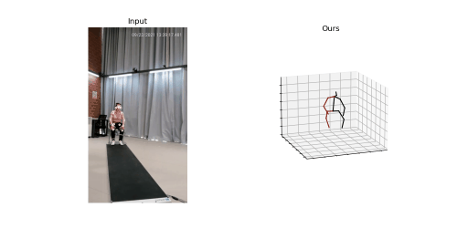

# P-STMO for PD

> pose estimation for PD

## Prerequisite

1. Environment
   - Linux system
   - Python > 3.6 distribution
2. Dependencies
   - **Packages**
      - Pytorch > 1.0.0
      - [torchsample](https://github.com/MVIG-SJTU/AlphaPose/issues/71#issuecomment-398616495)
      - [ffmpeg](https://ffmpeg.org/download.html)
      - tqdm
      - pillow
      - scipy
      - pandas
      - h5py
      - visdom
      - nibabel
      - opencv-python (install with pip)
      - matplotlib
  
## Usage

0. place your video into `./input` folder. (There are thre test videos there).

##### Testing

1. change the `video_path` in the `./videopose_PSTMO.py`
2. Run it! You will find the rendered output video in the `./outputs` folder.

## Acknowledgement
The codes are based on P-STMO codes, see https://github.com/paTRICK-swk/P-STMO

The 2D pose to 3D pose and visualization part is from [VideoPose3D](https://github.com/facebookresearch/VideoPose3D).

Some of the "In the wild" script is adapted from the other [fork](https://github.com/tobiascz/VideoPose3D).

The project structure and `./videopose.py` running script is adapted from [this repo](https://github.com/lxy5513/videopose)

## Future Work

The other feature will be added to improve accuracy in the future:

- [x] more data to be tested
- [x] Use PD data as our training data
- [x] use the 3D joints data to drive the neuromuscular model
- [x] Change 2D pose estimation method such as [AlphaPose](https://github.com/MVIG-SJTU/AlphaPose).
- [x] Test HR-Net as 2d joints detector.
- [x] Test LightTrack as pose tracker.

